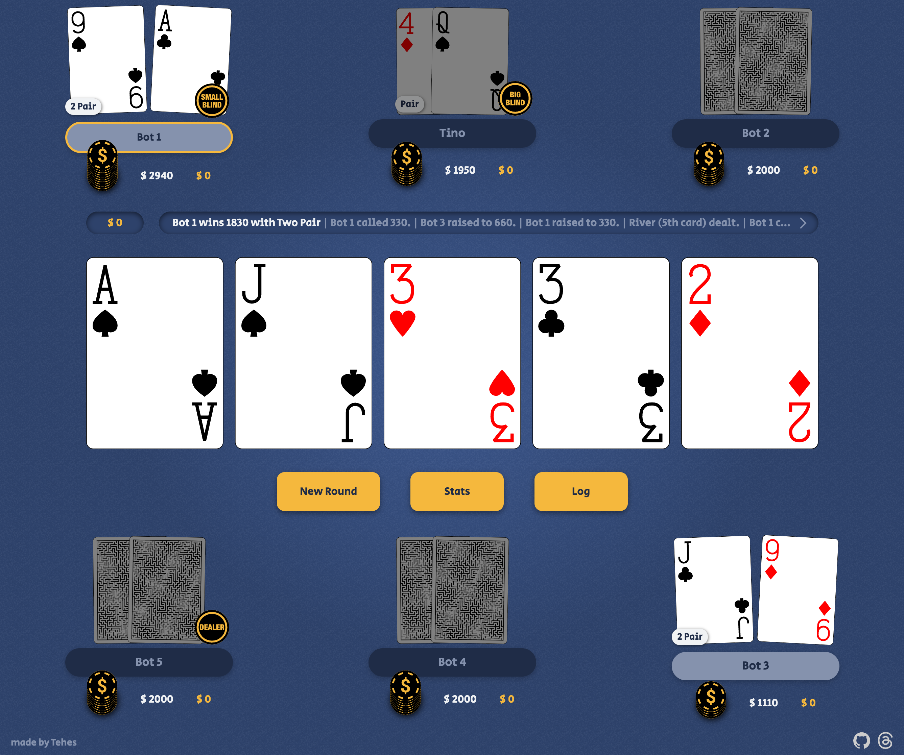

# Digital Poker Table



A browser-based poker table for Texas Hold'em. Play solo against bots or with friends. Each player
joins via QR code or link to use their own device, while the shared table handles the rest.

---

## License and usage

This project is source-available, not open source.

You may view and modify the code for personal, educational, and non-commercial purposes.

If you publicly redistribute this project or a modified version of it, you must:

- link to the original project: [https://github.com/Tehes/poker](https://github.com/Tehes/poker)
- include a visible in-app attribution such as “Based on Poker by Tehes” with a link to the original project
- clearly mark your version as modified and unofficial

Commercial use, paid hosting, resale, and misleading rebranding are not allowed without prior written permission.

---

## 🎯 Key Features

- **No Setup Required**: No app install, no sign-ups, no lobby and no configuration. Just enter
  names and start playing.
- **Local Solo Saves**: Unfinished Solo vs Bots games are saved locally in the browser and can be
  continued later on the same device.
- **Private Player Views**: Human players can join on their own devices without exposing private
  information on the shared screen.
- **QR + Link Joining**: Each human seat provides both a QR code and a direct link for easy access.
- **Companion / Remote Table Switching**: Joined players can switch between a compact companion view
  and the full remote table.
- **Remote Player Actions**: In synced multiplayer games, the active player can act directly from
  their own device.
- **Turn Sound Alerts**: An optional cue signals human turns on the shared table in solo games and
  on the active player's device in multiplayer. The sound setting is saved per device.
- **Automatic Game Logic**: Handles blinds, bets, pots, side pots, and showdown evaluations.
- **Progressive Blinds**: Blinds increase every 6 hands using a hand-based formula with safe
  nice-step rounding, so the pace stays stable even short-handed or heads-up.
- **Side Pot Support**: Accurately resolves complex all-in scenarios.
- **Dynamic Positioning**: Turn order and bot strategy adapt as players fold.
- **Supports All Table Sizes**: From heads-up to full-ring games.
- **Responsive Design**: Optimized for tablets, phones, and desktops.
- **Smart Bet Slider**: The bet slider highlights invalid amounts in red while dragging and snaps to
  the minimum legal raise when released.
- **Fast & Offline-Ready**: Loads fast and works offline once cached.
- **Built‑in Bots**: Empty player slots are automatically filled with bots.
- **Fast Forward for Bot-Only Hands**: When no human can act in the current hand, a Fast Forward
  button lets you speed through the remaining bot action. If no humans have chips left after that,
  the game keeps fast-forwarding until a winner remains.
- **Smart Bot Play**: Bots use tournament-style heuristics with M-ratio pressure, pot odds,
  position, opponent tendencies, and context-aware postflop aggression instead of fixed charts or
  simulations.
- **Postflop Hand Labels**: When hole cards are visible on the table, the shared screen shows short
  postflop hand categories.
- **Bot Reveals**: After some uncontested postflop wins, bots may occasionally reveal one or both
  hole cards to create small TV-poker moments.
- **Session Stats Overlay**: After each completed hand, open a compact stats view with stack, hands
  won, showdown results, folds, and all-ins for all active players.
- **Winner Reactions**: After a pot win, the shared table may briefly show a face emoji above each
  main-pot winner. Reactions are based only on public information such as pot size, split pots,
  all-ins, visible hand strength, reveals, and stack swings.

---

## 🎮 Main Play Modes

The same table supports different ways to play. The mode depends only on how many humans join.

- **Solo vs Bots (Open Cards)**: One human plays directly on the shared device while bots fill the
  empty seats. This is the fastest way to play and learn.
- **Spectator / TV Poker**: No humans join. All seats are bots, hole cards are visible, and the
  table becomes a self-running poker show.
- **Multiplayer**: Two or more humans join. They can play in the same room or anywhere in the world.
  Players can join on their own devices via QR code or link while the shared table remains the
  central board.
- **Hybrid Tables**: Humans and bots can mix freely. This makes it easy to run short-handed games,
  fill gaps, or teach new players without slowing the table down.

---

## 🚀 Getting Started

1. Open this URL on a shared device (e.g., tablet or laptop): 👉
   [https://tehes.github.io/poker](https://tehes.github.io/poker)

2. Add players by typing their names.

3. Start the game.

4. Human players can then join on their own devices via QR code or direct link.

The table handles dealing, blinds, betting, and showdown automatically.

---

## 📶 Offline Use

The table works fully offline after the first complete load.

- **First visit online** – When opened once with an internet connection, all necessary assets (HTML,
  JS, CSS, SVGs, icons) are cached in the browser.
- **Service Worker** – Handles cache-first requests and serves offline content when the network is
  unavailable.
- **Core Assets Pre‑cached** – Core assets are precached during install; any additional resources
  are loaded and cached on demand.
- **Updates** – A new version is fetched and activated in the background; refreshing the page loads
  the updated assets.
- **Graceful QR Fallback** – If sync is unavailable, the QR code can still carry embedded hole-card
  data so the companion view remains usable in read-only mode.

---

## 🛠️ Tech Stack

- **Vanilla HTML, CSS, and JavaScript** – no frameworks
- **Client-side game engine** – handles table state, betting flow, bots, showdown logic, and
  browserless engine test runs
- **Deno batch runners** – browserless engine batches for fast bot/engine validation, plus browser
  speedmode batches for end-to-end integration checks
- **Service Worker caching** – supports offline play after the first load
- **Optional Deno backend sync** – keeps multiplayer companion views and remote actions in sync
- **qr-creator** – QR code generation for device joining
- **pokersolver** – hand evaluation at showdown

---

## 🌐 Optional Backend Sync

Backend sync is used only in multiplayer games that start with at least 2 human players.

- **Solo and spectator games stay local** and keep a clean URL without `tableId`.
- **Solo saves are local-only**: unfinished Solo vs Bots games are stored in the browser on
  the shared device; multiplayer sync does not create persistent cloud sessions.
- **Human seats expose two entry points**: a QR code for the companion view (`hole-cards.html`) and
  a direct link for the full remote table (`remoteTable.html`).
- **Both views stay connected to the same seat** and can be switched at any time.
- **Player actions from joined devices** are relayed back to the shared table.
- **If the backend is unreachable**, the QR flow degrades gracefully to embedded hole-card data and
  read-only companion access.

---

## 🤖 How It Works

- The shared device runs the main table.
- Human players can join their seats on their own devices.
- Empty seats are filled with bots automatically.
- The table manages:
  - **Dealer rotation** and automatic blind posting
  - **Progressive blinds** that increase every 6 hands with a formula-based, nice-step schedule
    (e.g., 10/20 -> 20/40 -> 30/60 -> 40/80 -> 50/100 -> 60/120)
  - Side pots and all-ins
  - Automatic showdown resolution

---

## Bot Behavior (Tournament Logic)

Bots play **plausible, tournament-style poker** based on heuristics, not simulations or hidden information.  
The goal is not solver-perfect play, but **realistic, hard-to-exploit decisions** that resemble human tournament strategy.

Core principles:

- **Tournament pressure (M-ratio)**  
  Short-stack zones drive shove, call, and raise behavior based on Harrington-style logic.

- **Private strength vs board strength**  
  Postflop decisions are based on how much the hole cards improve the board.  
  Bots distinguish between:
  - board-driven strength (shared by everyone)
  - true private edge (unique to the player)

- **Private-aware strength model**  
  Raw hand strength is adjusted by private edge, so bots don’t overvalue strong-looking boards  
  (e.g. trips on a paired board) and don’t undervalue real made hands.

- **Risk-aware decision making**  
  Calls and folds are influenced by:
  - pot odds
  - stack commitment
  - elimination risk  
  Expensive decisions require stronger justification, but strong private hands can override pure survival logic.

- **Position and table dynamics**  
  Bots adapt aggression based on position, number of opponents, and remaining players.

- **Opponent tendencies (lightweight reads)**  
  VPIP, aggression, fold rate, and showdown strength slightly shift thresholds without dominating decisions.

- **Board texture and draw equity**  
  Wet boards increase protection and reduce bluffing; dry boards enable more aggression.

- **Balanced bluffing and bluff-catching**  
  Bots do not only wait for value. They mix in bluffs and defend thin bluff-catch spots often enough to avoid becoming trivially exploitable.

- **Uncapped checked ranges**  
  A bot check after the flop does not automatically mean weakness. Strong value hands can sometimes
  check, either to continue normally against pressure or to raise when an opponent bets into them on
  the same street.

- **Bet-size-aware defense**  
  Bots react to bet size, pot odds, and minimum-defense pressure, so small and medium bets into
  checked ranges are less automatically profitable.

- **Marginal hands stay playable**  
  Thin showdown hands, small made hands, and weaker draws are handled more carefully instead of
  collapsing into automatic folds or automatic aggression.

- **Controlled initiative (checked-to play)**  
  When no one bets, bots selectively take the lead depending on position, board context, and opponent behavior.  
  Weak or risky spots are filtered out to avoid over-aggression.

- **Line consistency**  
  Simple betting plans (c-bet, barrel) are carried across streets but can be aborted on bad runouts.

- **Tournament-style preflop ranges and sizing**  
  Preflop choices use position, hand family, blind context, and fixed tournament-style sizing for
  opens, 3-bets, squeezes, and short-stack pressure.

- **Strict guardrails**  
  The system prevents unrealistic behavior:
  - no folding premium preflop hands  
  - no bluffing with made hands  
  - no absurd folds of strong private hands  
  - no broken multi-raise sequences  

---

## 🧠 Design Philosophy

- **Local-first**: Works without network once loaded.
- **Optional back-end sync**: Core state is client-side, with best-effort syncing when available.
- **Zero footprint**: No accounts, no sign-ups, no persistent cloud state.
- **Focus on flow**: The app enforces rules and turn order so you can focus on the game.
- **Tournament-style**: Progressive blinds keep games from stalling.

---

## 🐞 Debugging and Batch Testing

Set `DEBUG_FLOW` to `true` in `js/app.js` to print detailed, timestamped messages about the betting
flow. Enable this flag when investigating hangs or unexpected behavior.

### Automated Batch Runs

For repeatable bot-vs-bot runs with detailed decision logs and aggregate bot-behavior metrics, use
the browserless engine batch runner first:

```sh
deno task engine:batch
deno task engine:batch:equity
deno task engine:batch:500
deno task engine:batch:1000
```

`engineBatch` runs full bot tournaments directly through the pure engine without launching a
browser. It is the primary runner for bot tuning, poker-rule changes, tournament flow, outcome
joining, and large samples. It writes one log plus one JSON summary per run. By default the output
goes to `tmp/poker-engine-batch-YYYYMMDD-HHMMSS/` and includes a combined `summary.json`.
`deno task engine:batch` runs 100 tournaments by default; use the 500 or 1000 task when a bot-tuning
change is noisy and needs a larger sample.

`deno task engine:batch:equity` enables a slower diagnostic pass after each run. It enriches
postflop decisions with approximate current equity against the still-active players' actual hole
cards; Turn and River are exact, Flop is exact under the normal board cap, and Preflop stays off by
default because hand family, position, domination, and playability are usually more useful there.
Use `--equity-preflop` only when you explicitly want selective Preflop leak candidates included.

Use the browser speedmode runner only when you need an end-to-end browser smoke test:

```sh
deno task speedmode
deno task speedmode:10
```

`speedmodeBatch` starts a local static server, opens the table in headless Chrome with
`?speedmode=1&botdebug=detail`, and writes one log plus one JSON summary per run. By default the
output goes to `tmp/poker-speedmode-batch-YYYYMMDD-HHMMSS/`. Use it for app integration, DOM,
timer, notification, animation, bootstrap, and browser-context behavior.

Both runners share the same analysis layer. The detailed bot log includes tags such as `PMH`
(private made hand via positive edge), `Edge` (private score minus public board score), and `PRE`
(private raise edge at `>= 0.05`) to make postflop validation easier. `LT` distinguishes `none`,
`kicker`, `meaningful`, and `structural` lifts.

Recommended workflow: after bot logic, engine rules, or tournament-flow changes, run
`deno task engine:batch` first. If the direction still looks plausible but noisy, run
`engine:batch:500` or `engine:batch:1000`. After browser orchestration or UI-side-effect changes,
run `deno task speedmode` or `deno task speedmode:10`.

Useful overrides:

```sh
deno task engine:batch -- --runs=25 --max-hands=500
deno task engine:batch -- --out=tmp/poker-engine-latest
deno task engine:batch -- --equity --equity-limit=1000
deno task engine:batch -- --equity-preflop --runs=10
CHROME_BIN="/Applications/Google Chrome.app/Contents/MacOS/Google Chrome" deno task speedmode -- --runs=3
deno task speedmode -- --out=tmp/poker-speedmode-latest
```

---

## 📋 Known Limitations

- Live syncing is best-effort; if the backend is unreachable, joined devices fall back to read-only
  companion access, and actions stay on the shared table.
- Saved games are local to the same browser/device and apply only to Solo vs Bots games.
- Remote table links are lightweight and trust-based; there are no seat tokens or connection checks
  yet.
- The blind progression (formula-based increase every 6 hands) is not customizable.

---

## 🙌 Credits

- [pokersolver](https://github.com/goldfire/pokersolver) for hand ranking logic
- [qr-creator](https://github.com/nimiq/qr-creator) for QR code generation
